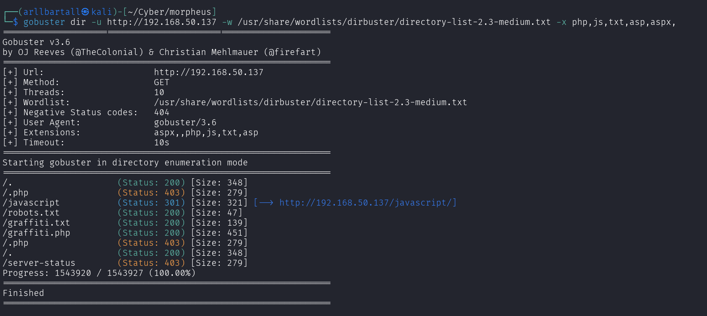
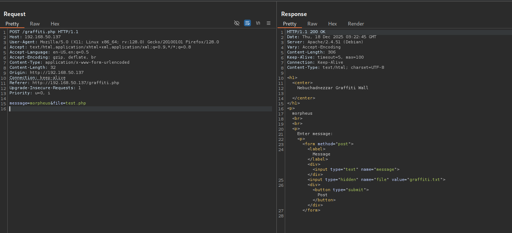
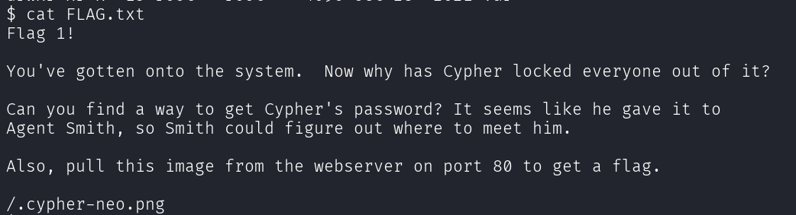
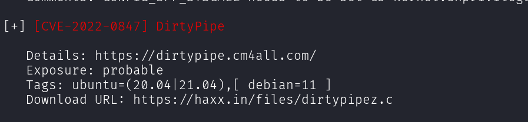
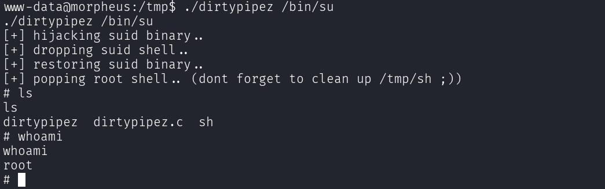
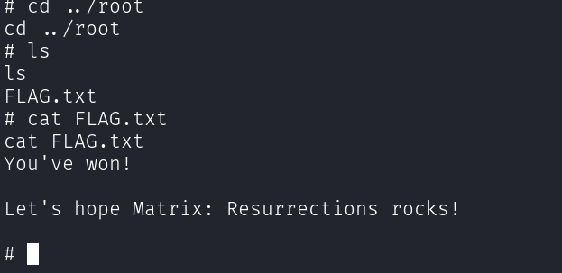

# VulnHub-Morpheus-Penetration-Testing-Report

Author: Oarabile Ntlhe  
Role: Penetration Tester  
Lab Source: Matrix-Breakout: 2 Morpheus  
Assessment Type: Black-box  
Date: 2025-12-18  

# Table of Contents  
1. [Project Overview](#project-overview)
2. [Objectives](#objectives)
3. [Reconnaissance](#reconnaissance)
4. [Enumeration](#enumeration)
5. [Privilege Escalation](#privilege-escalation)

# Project Overview

This repository documents a full penetration test of the VulnHub Morpheus virtual machine.  
The objective of this project is to simulate a real-world penetration testing engagement by identifying, exploiting, and documenting vulnerabilities from initial access to full system compromise.  

This project is designed for:
  - Demonstrating offensive security skills  
  - Showcasing professional reporting  
  - GitHub & portfolio visibility  

# Objectives 

* Identify exposed services and attack vectors
* Gain initial foothold on the target system
* Escalate privileges to root/administrator
* Document findings using industry-style reporting
* Provide remediation recommendations

# Reconnaissance  

## Network Discovery  

The engagement began with network discovery to identify active hosts within the target scope. An arp-scan of the 192.168.50.0/24 subnet was performed. This scan identified the Morpheus virtual machine host at IP address 192.168.50.137, which was subsequently designated as the primary target for testing.
```bash
  sudo arp-scan -l
```


## Port Scanning 

Following host discovery, comprehensive port and service enumeration was performed against the target host (192.168.50.137). This phase aimed to identify all accessible network services and their associated software versions, which is critical for vulnerability analysis.  
```bash
  nmap -p- 192.168.50.137 -T4

  nmap -sCV -p 22,80,81 192.168.50.137
```


# Enumeration  

Following service discovery, which identified HTTP services on ports 80 and 81, directory enumeration was performed against the primary web application (http://192.168.50.137:80) using Gobuster. This brute-force technique systematically tests for common and hidden directories that may contain sensitive information or functionality.  
```bash
  gobuster dir -u http://192.168.50.137 -w /usr/share/wordlists/dirbuster/directory-list-2.3-medium.txt -x php,js,txt,asp,aspx
```

  

#### Key Findings  
  - robots.txt
  - graffiti.txt
  - graffiti.php  

# Exploitation  

## Remote Code Execution via File Write Vulnerability  
Risk: Critical  
CVSS: 9.8  
Affected Component: graffiti.php on port 80  

### Description  

The graffiti.php application contains a file write vulnerability that allows unauthenticated attackers to write arbitrary content to the web server. This functionality lacked proper input validation and file extension restrictions, enabling the upload of PHP scripts leading to remote code execution.  

### Exploitation Path:  
  - Discovery: Analysis of graffiti.php revealed a text input field that directly wrote user-supplied data to graffiti.txt on the server.
  - Interception: Using Burp Suite, the HTTP POST request was intercepted and examined in the Repeater module.
  - Manipulation: The request was modified to replace the benign text payload with a PHP reverse shell script and change the target filename to shell.php.
  - Execution: A netcat listener was established, and navigating to http://192.168.1.105/shell.php triggered the reverse shell connection.  

  

  

### Impact  

Successful exploitation provides unauthenticated remote code execution with web server privileges, potentially leading to complete system compromise, data exfiltration, and lateral movement within the network.  

### Recommendation  
  - Implement strict input validation and sanitization
  - Restrict file write operations to non-executable directories  
  - Validate file extensions and content before writing
  - Remove unnecessary file write functionality

# Privilege Escalation  

### Description  

After obtaining initial access as the www-data user, privilege escalation analysis was performed using the LinPEAS enumeration script. This identified a vulnerable kernel version susceptible to the DirtyPipe vulnerability. Exploitation of this kernel flaw allowed the www-data user to overwrite arbitrary read-only files, including SUID binaries, leading to full root compromise.  

### Exploitation Process  
  - Post-Exploitation Enumeration: The LinPEAS script was transferred to the target and executed to identify potential privilege escalation vectors.
  - Vulnerability Identification: LinPEAS output indicated a vulnerable kernel susceptible to CVE-2022-0847 (DirtyPipe).
  - Exploit Deployment: A publicly available DirtyPipe exploit was compiled and executed on the target system.
  - Privilege Escalation: The exploit modified the SUID /bin/su binary to grant root privileges, resulting in a full root shell.

  
  
  
