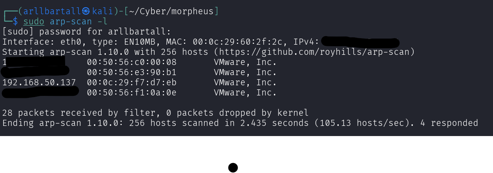
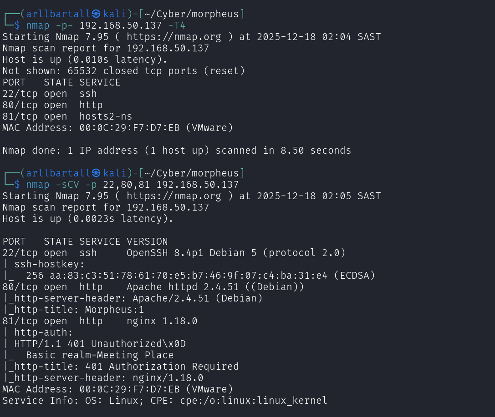

# VulnHub-Morpheus-Penetration-Testing-Report

Author: Oarabile Ntlhe  
Role: Junior Penetration Tester  
Lab Source: VulnHub – Morpheus  
Assessment Type: Black-box 
Date: 2025-12-18  

# Table of Contents  
1. [Project Overview](#-project-overview)
2. [Objectives](#-objectives)
3. [Reconnaissance](#reconnaissance)

# Project Overview

This repository documents a full penetration test of the VulnHub Morpheus virtual machine.  
The objective of this project is to simulate a real-world penetration testing engagement by identifying, exploiting, and documenting vulnerabilities from initial access to full system compromise.  

This project is designed for:
  - Demonstrating offensive security skills  
  - Showcasing professional reporting  
  - GitHub & portfolio visibility  

# Objectives 

* Identify exposed services and attack vectors
* Gain initial foothold on the target system
* Escalate privileges to root/administrator
* Document findings using industry-style reporting
* Provide remediation recommendations

# Reconnaissance  

## Network Discovery  

The engagement began with network discovery to identify active hosts within the target scope. An arp-scan of the 192.168.50.0/24 subnet was performed. This scan identified the Morpheus virtual machine host at IP address 192.168.50.137, which was subsequently designated as the primary target for testing.
```bash
  sudo arp-scan -l
```



## Port Scanning 

Following host discovery, comprehensive port and service enumeration was performed against the target host (192.168.50.137). This phase aimed to identify all accessible network services and their associated software versions, which is critical for vulnerability analysis.  
```bash
  nmap -p- 192.168.50.137 -T4

  nmap -sCV -p 22,80,81 192.168.50.137
```


